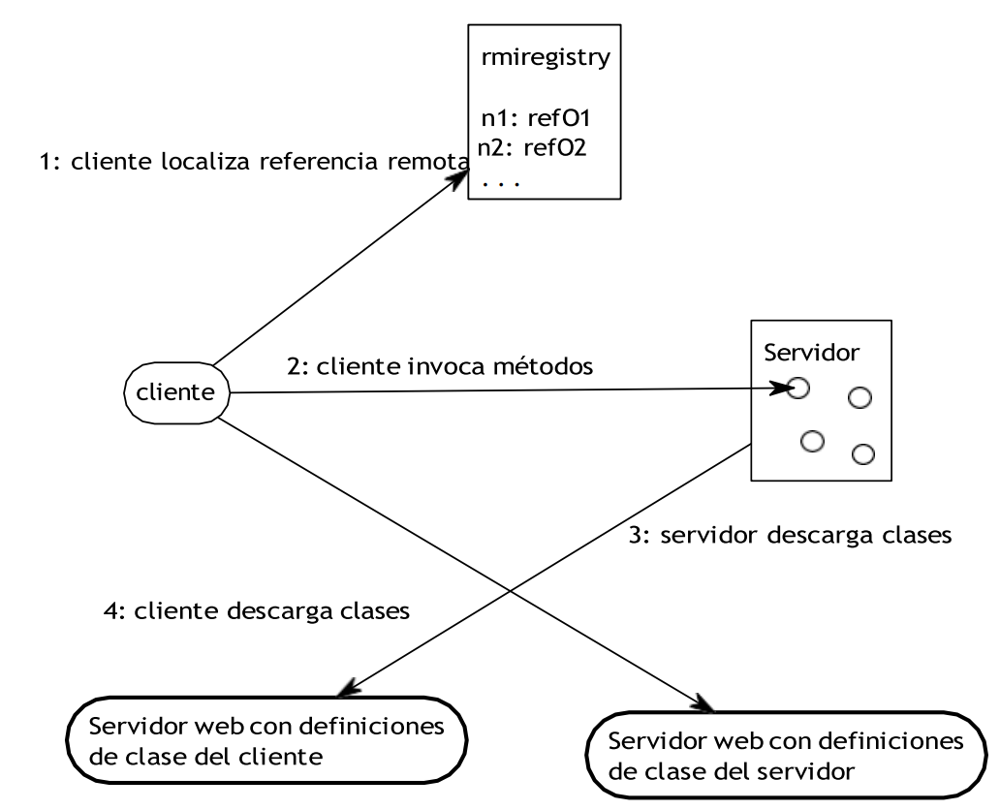

# Call-Return
## Introducción a esquemas de nombres, redes, clientes y servicios con Java

## Inicio rápido (Ejercicios 1, 2 y 3)

Para evitar errores de rutas al compilar en Windows, Se ejecutan los comandos desde la raíz del proyecto:

### CMD

```bat
cd /d C:\Users\maria\OneDrive\Documentos\arsw\Labs\Lab3\Call-Return
javac -d out src\ejercicio1\URLReader.java src\ejercicio2\URLReader.java src\ejercicio3\*.java

java -cp out ejercicio1.URLReader
java -cp out ejercicio2.URLReader
```

Para el ejercicio 3, use dos terminales:

```bat
java -cp out ejercicio3.Servermain
java -cp out ejercicio3.Clientemain
```

### PowerShell

```powershell
Set-Location "C:\Users\maria\OneDrive\Documentos\arsw\Labs\Lab3\Call-Return"
javac -d out src/ejercicio1/URLReader.java src/ejercicio2/URLReader.java src/ejercicio3/*.java

java -cp out ejercicio1.URLReader
java -cp out ejercicio2.URLReader
```

Para el ejercicio 3, use dos terminales:

```powershell
java -cp out ejercicio3.Servermain
java -cp out ejercicio3.Clientemain
```

## Completados: (1, 3 y 4.3.2)

- **Ejercicio 1** (`src/ejercicio1/URLReader.java`): imprime los 8 datos del objeto URL:
  `getProtocol`, `getAuthority`, `getHost`, `getPort`, `getPath`, `getQuery`, `getFile`, `getRef`.
- **Ejercicio 3.1** (`src/ejercicio3`): cliente-servidor por sockets donde el servidor recibe un número y responde su cuadrado.
- **Ejercicio 4.3.2** (`src/ejercicio4`):
  - operación por defecto: `cos`
  - cambio de operación con comandos: `fun:sin`, `fun:cos`, `fun:tan`
  - cálculo trigonométrico sobre el valor recibido en **radianes**.

### Compilar y ejecutar ejercicio 4

```bat
javac -d out src\ejercicio4\*.java
```

Servidor (terminal 1):

```bat
java -cp out ejercicio4.Servermain
```

Cliente (terminal 2):

```bat
java -cp out ejercicio4.Clientemain
```

Ejemplo de uso en cliente:

```text
0
1.57079632679
fun:sin
0
exit
```

## Funcionamiento ejercicio 5 (Servidor Web)

El ejercicio 5 implementa un servidor HTTP secuencial (no concurrente) que:

- atiende múltiples solicitudes seguidas en el puerto `35000`.
- sirve archivos desde la carpeta `src/ejercicio5`.
- cuando la ruta es `/`, responde el archivo `index.html`.
- retorna `404 Not Found` si el archivo no existe.
- soporta archivos HTML e imágenes (jpg, jpeg, png, gif, svg, ico).

### Compilar y ejecutar

```bat
javac -d out src\ejercicio5\HttpServer.java
java -cp out ejercicio5.HttpServer
```

### Pruebas rápidas

Abrir en navegador:

- `http://127.0.0.1:35000/`
- `http://127.0.0.1:35000/index.html`

Para validar 404:

- `http://127.0.0.1:35000/no-existe.png`

## 1. Reconocimiento

Parte de los contenidos y códigos de este taller es t án   basados en los contenidos de los 
tutoriales de Java que se encuentran en: 

https://docs.oracle.com/javase/tutorial/networking/index.html. 

## 2. Conceptos básicos de redes

Los programas que se comunican a través de internet utilizan generalmente dos 
protocolos: el Transmission Control Protocol (TCP) o el User Datagram Protocol (UDP). 
En java en general usted utiliza clases ya implementadas en el paquete java.net. 

### 2.1. TCP

El Transmission Control Protocol (TCP) es un protocolo basado en conexión que 
provee una conexión confiable entre dos computadores. TCP en particular mantiene el 
orden de los paquetes de datos y garantiza que todos los datos se entreguen. 

### 2.2. UDP

El User Datagram Protocol (UDP) es un protocolo que envía los datos en paquetes 
llamados datagramas, no provee garantía de entrega ni de orden de entrega. Este 
protocolo no está basado en conexión.  

### 2.3. Que son los puertos

En general los computadores tienen una sola conexión a internet y todos los datos que 
llegan y salen utilizan esta conexión física. Sin embargo, el computador puede tener 
múltiples  aplicativos que utilizan la red. Para separar la información que es enviada a una 
aplicativo específico se asignó un n ú me ro  lógico a cada aplicación. Este n ú me ro  es 
denominado el puerto y, como veremos m á s  a d e l a n t e , es utilizado para enviar datos a 
aplicaciones específicas en computadores remotos. 

Los protocolos de TCP y UDP utilizan estos puertos para enviar los datos que llegan 
a las aplicaciones correctas. Recuerde que cada aplicación que espera datos de la red se le 
asigna un puerto para que puede escuchar los datos que llegan a un puerto determinado. 

Los puertos se representan con un entero de 16 bits y tienen un rango de 0 hasta 
65.535. Los puertos de 0- 1023 es t án  restringidos para aplicaciones específicas por 
ejemplo el 80 es para el servidor web. 

### 2.4. Clases que soportan el trabajo con redes en Java

Algunas de las clases que utilizan TCP en Java son: URL, URLConnection, Socket  
y ServerSocket. Todas e s t á n en el paquete java.net. 

Algunas de las clases que utilizan UDP en Java son:DatagramPacket, Data- 
gramSocket y MulticastSocket . Todas es t án  en el paquete java.net. 

## 3. Trabajando con URLs

URL es la abreviación de Uniform Resource Locator, y es básicamente una 
dirección para localizar recursos en internet. Una idea clara de cómo son las URLs la 
encontramos en nuestro navegador de internet. Así, la forma general de una URL es la 
siguiente: 

<protocolo>://<servidor>:<puerto>/<dirección del recurso en el servidor> 

un ejemplo concreto es: 

http://ldbn.escuelaing.edu.co:80/index.html    

En java se puede crear un URL de varias maneras: 

```java
URL  personalSite  =  new  URL("http://ldbn.escuelaing.edu.co:80/");
```
Este código crea un objeto de tipo URL que lo asigna a la variable personalSite. También
puede crear una URL relativa a otra de la siguiente manera:

```java
URL  misPublicaciones  =  new  URL(personalSite,  "publications_bib.html");
```

Todos los constructores de la URL lanzan excepciones MalformedURLException, por
lo que es necesario colocarlos dentro de un bloque try-catch.

```java
try {

URL myURL = new URL(. . .)

} catch (MalformedURLException e) {

e.printStackTrace();

}
```

```java
import java.io.*;
import java.net.*;
public class URLReader {
    public static void main(String[] args) throws Exception {
        URL google = new URL("http://www.google.com/");
        try (BufferedReader reader
        = new BufferedReader(new InputStreamReader(google.openStream()))) {
            String inputLine = null;
            while ((inputLine = reader.readLine()) != null) {
            System.out.println(inputLine);
            }
        } catch (IOException x) {
            System.err.println(x);
        }
    }
}
```
Figura 1. Clase que lee datos de internet

### 3.1. Leyendo los valores de un objeto URL
El programador puede usar varios métodos para leer la información de un objeto
URL: getProtocol, getAuthority, getHost, getPort, getPath, getQuery, getFile, getRef.

**EJERCICIO 1**
Escriba un programa en el cual usted cree un objeto URL e imprima en pantalla cada
uno de los datos que retornan los 8 métod os de la sección anterior.

### 3.2. Leyendo páginas de internet
Para leer páginas de internet debe crear flujos de datos (streams) y leer como si lo
hiciera del teclado. El ejemplo siguiente lee datos de internet y los presenta en la pantalla
(fig. 1).

**EJERCICIO 2**
Escriba una aplicación browser que pregunte una dirección URL al usuario y que lea
datos de esa dirección y que los almacene en un archivo con el nombre resultado.html.
Luego intente ver este archivo en el navegador.

## 4. Sockets (enchufes)
Los sockets son los puntos finales del enlace de comunicación entre dos programas
ejecutándose en la red. Cada socket está vinculado a un puerto específico,

```java
import java.io.*;
import java.net.*;
public class URLReader {
public static void main(String[] args) throws Exception {
URL google = new URL("http://www.google.com/");
try (BufferedReader reader
= new BufferedReader(new InputStreamReader(google.openStream()))) {
String inputLine = null;
while ((inputLine = reader.readLine()) != null) {
System.out.println(inputLine);
}
} catch (IOException x) {
System.err.println(x);
}
}
}
```

4
así la capa que implementa el protocolo TCP puede saber a qué aplicación enviar los
mensajes. En general un servidor es un proceso que se ejecuta y tiene un socket,
vinculado a un puerto, que está esperando solicitudes de clientes externos. Los sockets son
una abstracción de m á s bajo nivel que las URLs y sirven para implementar protocolos de
comunicación cliente-servidor.
El protocolo cliente servidor consiste en un programa cliente que hace solicitudes a un
programa servidor que atiende dichas solicitudes.
Java provee dos clases para manejar la comunicación por medio de sockets: Socket y
ServerSocket. Ambas clases se encuentran en el paquete java.net.
**NOTA:** Una idea clara para entender los sockets es imaginar que son los enchufes
donde se conectan las aplicaciones para comunicarse.

### 4.1. Como usar los sockets desde el cliente
Vamos a utilizar sockets para crear un pequeño aplicativo cliente servidor. El aplicativo
consiste en un cliente que envía mensajes y un servidor que responde con el mismo
mensaje, pero con una cadena “Respuesta:” al principio de este. El servidor también
imprime en pantalla los mensajes que recibe.
Antes de ver el código del cliente es importante ver que para obtener una conexión se
usa el código:

`miSocket = new Socket("127.0.0.1", 35000);`

donde “127.0.0.1” es el host local y 35000 es el puerto. Estas sentencias tienen que estar
rodeadas de bloque try-catch, para capturar los errores de conexión.
Una vez tenga la conexión, puede obtener flujos (Streams) de entrada y salida
utilizando

`out = new PrintWriter(echoSocket.getOutputStream(), true); in = new BufferedReader(new InputStreamReader(echoSocket.getInputStream()));`

Una vez tenga los streams, puede enviar solicitudes y recibir las respuestas. No olvide
cerrar los sockets y los flujos. La figura 2 muestra el código del cliente.
### 4.2. Como utilizar los sockets desde el servidor
La siguiente parte consiste en implementar el servidor. El servidor escucha en un
puerto y responde a las solicitudes de cada cliente.
La figura 3 tiene el código del servidor. Este servidor responde el mismo mensaje que
recibe.
### 4.3. Ejercicios
#### 4.3.1.
Escriba un servidor que reciba un n ú mero y responda el cuadrado de este número.

```java
import java.io.*;
import java.net.*;
public class EchoClient {
public static void main(String[] args) throws IOException {
Socket echoSocket = null;
PrintWriter out = null;
BufferedReader in = null;
try {
echoSocket = new Socket("127.0.0.1", 35000);
out = new PrintWriter(echoSocket.getOutputStream(), true);
in = new BufferedReader(new InputStreamReader(
echoSocket.getInputStream()));
} catch (UnknownHostException e) {
System.err.println("Don’t know about host!.");
System.exit(1);
} catch (IOException e) {
System.err.println("Couldn’t get I/O for "
+ "the connection to: localhost.");
System.exit(1);
}
BufferedReader stdIn = new BufferedReader(
new InputStreamReader(System.in));
String userInput;
while ((userInput = stdIn.readLine()) != null) {
out.println(userInput);
System.out.println("echo: " + in.readLine());
}
out.close();
in.close();
stdIn.close();
echoSocket.close();
}
}
```

```java
import java.net.*;
import java.io.*;
public class EchoServer {
public static void main(String[] args) throws IOException {
ServerSocket serverSocket = null;
try {
serverSocket = new ServerSocket(35000);
} catch (IOException e) {
System.err.println("Could not listen on port: 35000.");
System.exit(1);
}
Socket clientSocket = null;
try {
clientSocket = serverSocket.accept();
} catch (IOException e) {
System.err.println("Accept failed.");
System.exit(1);
}
PrintWriter out = new PrintWriter(clientSocket.getOutputStream(), true);
BufferedReader in = new BufferedReader(
new InputStreamReader(
clientSocket.getInputStream()));
String inputLine, outputLine;
while ((inputLine = in.readLine()) != null) {
System.out.println(‘‘Mensaje:’’ + inputLine);
outputLine = ‘‘Respuesta’’ + inputLine ;
out.println(outputLine);
if (outputLine.equals("Respuestas: Bye."))
break;
}
out.close();
in.close();
clientSocket.close();
serverSocket.close();
}
}
```
Figura 3. Clase servidor que regresa el mismo mensaje que lee

#### 4.3.2.
Escriba un servidor que pueda recibir un n ú me ro y responda con una operación sobre
este número. Este servidor puede recibir un mensaje que empiece por “fun:”, si recibe este
mensaje cambia la operación a las especificada. El servidor debe responder las funciones
seno, coseno y tangente. Por defecto debe empezar calculando el coseno. Por ejemplo, si el
primer n ú mero que recibe es 0, debe responder 1, si después recibe π/2 debe responder 0,
si luego recibe “fun:sin” debe cambiar la operaci´on actual a seno, es decir a partir de ese
momento debe calcular senos. Si enseguida recibe 0 debe responder 0.
### 4.4. Servidor web
El código 4 presenta un servidor web que atiende una solicitud. Implemente el servidor
e intente conectarse desde el browser.
### 4.5. Ejercicios
#### 4.5.1.
Escriba un servidor web que soporte múltiples solicitudes seguidas (no concurrentes).
El servidor debe retornar todos los archivos solicitados, incluyendo páginas html e
imágenes.
## 5. Datagramas
Los programas escritos en las secciones anteriores presentan ejemplos de aplicaciones
que se conectan punto a punto con otras aplicaciones. Estos ejemplos usaban por debajo el
protocolo TCP.
Esta sección muestra programas que se comunican sin importar si los mensajes
enviados fueron o no recibidos, o en qué orden llegan. Esto, se implementa usando el
protocolo UDP. La abstracción fundamental para hacer este tipo de programas es el
datagrama y el java.net.DatagramSocket.
### 5.1. Datagramas
Un datagrama es un mensaje independiente autocontenido que es enviado a través de la
red, y cuya llegada, tiempo de llegada y contenido no son garantizados.
Estos datagramas son útiles para implementar servicios cuyos mensajes no tienen un
contenido del cual dependen procesos fundamentales. Por ejemplo, usted quiere que la
comunicación entre un avión y la torre de control sea inmediata y garantizada, sin embargo,
si tiene una página que muestra el estado del tiempo en la playa, no le importa si el último
mensaje es de hace 1 hora y de pronto no es tan exacto.

```java
import java.net.*;
import java.io.*;
public class HttpServer {
public static void main(String[] args) throws IOException {
ServerSocket serverSocket = null;
try {
serverSocket = new ServerSocket(35000);
} catch (IOException e) {
System.err.println("Could not listen on port: 35000.");
System.exit(1);
}
Socket clientSocket = null;
try {
System.out.println("Listo para recibir ...");
clientSocket = serverSocket.accept();
} catch (IOException e) {
System.err.println("Accept failed.");
System.exit(1);
}
PrintWriter out = new PrintWriter(clientSocket.getOutputStream(), true);
BufferedReader in = new BufferedReader(
new InputStreamReader(
clientSocket.getInputStream()));
String inputLine, outputLine;
while ((inputLine = in.readLine()) != null) {
System.out.println("Received: " + inputLine);
if (!in.ready()) {
break;
}
}
outputLine = "<!DOCTYPE html>"
+ "<html>"
+ "<head>"
+ "<meta charset=\"UTF-8\">"
+ "<title>Title of the document</title>\n"
+ "</head>"
+ "<body>"
+ "My Web Site"
+ "</body>"
+ "</html>" + inputLine;
out.println(outputLine);
out.close();
in.close();
clientSocket.close();
serverSocket.close();
}
}
```

Figura 4: clase que implementa un servidor web de un request

En esta sección vamos a construir un servidor que reporta la hora cuando recibe un
mensaje que le solicita este servicio. Igualmente construiremos un cliente que pide el
servicio.
La figura 5 implementa un servidor de datagramas. El servidor primero crea un objeto
de tipo Datagramsocket y lo asocia al puerto 45000. Después, en le método
startServer crea un buffer de 256 bytes que es usado para crear un DatagramPacket con
este taman˜ o. Una vez se tiene el paquete creado se le dice que espere por un paquete,
DatagramPacket packet = new DatagramPacket(buf, buf.length);
socket.receive(packet);
el servidor espera a recibir un mensaje, y una vez lo recibe, lee la información de
dirección ip y puerto de origen. Con esta información crea un paquete de respuesta
mensaje de respuesta y responde al cliente.
La figura 6 implementa un cliente de datagramas. Este cliente crea un socket de
datagramas pegado a un puerto, luego crea un paquete de salida y envía el datagrama
al cliente solicitado. Luego espera por la respuesta del servidor. Observe que si no tiene
respuesta el cliente se queda esperando para siempre. Si necesita cancelar la espera,
puede hacer un pool de hilos, colocar la actividad en un hilo del pool, y asignarle un tiempo
máximo de espera al pool de hilos.
### 5.2. Ejercicios
#### 5.2.1.
Utilizando Datagramas escriba un programa que se conecte a un servidor que
responde la hora actual en el servidor. El programa debe actualizar la hora cada 5
segundos s egu´n los datos del servidor. Si una hora no es recibida debe mantener la hora
que tenía. Para la prueba se apagar´a el servidor y después de unos segundos se
reactivar´a. El cliente debe seguir funcionando y actualizarse cuando el servidor este
nuevamente funcionando.
## 6. Invocación remota de métodos: RMI
El sistema RMI (Remote method invocation) permite a un programa co- rriendo en
un m´aquina virtual de Java llamar los m´etodos de objetos que est´an corriendo en otra
m´aquina virtual de Java. Es decir, RMI permite la comunicación, utilizando un modelo
orientado a objetos, entre dos aplicaciones Java.
### 6.1. Modelo general de comunicacio´n
El modelo RMI busca implementar un modelo de objetos distribuidos con una
sem´antica clara, simple y cercana a la sem´antica de objetos propuesta en el lenguaje de
programaci´on Java. Por esto utiliza las abstracciones de objeto y m´etodo como eje
fundamental del modelo. Así, en un aplicaci´on distribuida

```java
import java.io.IOException;
import java.net.DatagramPacket;
import java.net.DatagramSocket;
import java.net.InetAddress;
import java.net.SocketException;
import java.util.Date;
import java.util.logging.Level;
import java.util.logging.Logger;
public class DatagramTimeServer {
DatagramSocket socket;
public DatagramTimeServer() {
try {
socket = new DatagramSocket(4445);
} catch (SocketException ex) {
Logger.getLogger(DatagramTimeServer.class.getName()).log(Level.SEVERE, null, ex);
}
}
public void startServer() {
byte[] buf = new byte[256];
try {
DatagramPacket packet = new DatagramPacket(buf, buf.length);
socket.receive(packet);
String dString = new Date().toString();
buf = dString.getBytes();
InetAddress address = packet.getAddress();
int port = packet.getPort();
packet = new DatagramPacket(buf, buf.length, address, port);
socket.send(packet);
} catch (IOException ex) {
Logger.getLogger(DatagramTimeServer.class.getName()).log(Level.SEVERE, null, ex);
}
socket.close();
}
public static void main(String[] args){
DatagramTimeServer ds = new DatagramTimeServer();
ds.startServer();
}
}
```

Figura 5: clase que implementa un servidor de datagramas

```java
import java.io.IOException;
import java.net.DatagramPacket;
import java.net.DatagramSocket;
import java.net.InetAddress;
import java.net.SocketException;
import java.net.UnknownHostException;
import java.util.logging.Level;
import java.util.logging.Logger;
public class DatagramTimeClient {
public static void main(String[] args) {
byte[] sendBuf = new byte[256];
try {
DatagramSocket socket = new DatagramSocket();
byte[] buf = new byte[256];
InetAddress address = InetAddress.getByName("127.0.0.1");
DatagramPacket packet = new DatagramPacket(buf, buf.length, address, 4445);
socket.send(packet);
packet = new DatagramPacket(buf, buf.length);
socket.receive(packet);
String received = new String(packet.getData(), 0, packet.getLength());
System.out.println("Date: " + received);
} catch (SocketException ex) {
Logger.getLogger(DatagramTimeClient.class.getName()).log(Level.SEVERE, null, ex);
} catch (UnknownHostException ex) {
Logger.getLogger(DatagramTimeClient.class.getName()).log(Level.SEVERE, null, ex);
} catch (IOException ex) {
Logger.getLogger(DatagramTimeClient.class.getName()).log(Level.SEVERE, null, ex);
}
}
}
```
Figura 6: clase que implementa un cliente de datagramas

típica el servidor crea uno o varios objetos que se hacen disponibles para atender llamados remotos. Por
su parte, el cliente localiza estos objetos, obtiene referencias remotas a ellos y llama sus m´etodos. Para
lograr esto la aplicaci´on necesita soportar los siguientes mecanismos:
Mecanismos de localizaci´on de objetos remotos: para hacer un llamado remoto un
cliente necesita saber la referencia remota de un objeto. Hay muchos mecanismos
para obtener esta referencia, por ejemplo, podría recibir un e-mail, un mensaje de
texto, o incluso recibirla por teléfono. El mecanismo no es importante, lo importante es
tener la referencia. Sin embargo, RMI provee un servicio de nombres (rmiregistry)
que permite que el servidor publique sus objetos asoci´andolos con un nombre, y
permita también que el cliente obtenga la referencia a un objeto remoto por me- dio
de dicho nombre. Otra forma de recibir referencias remotas es que sean pasadas
como par´ametros o valores de retorno cuando se invoca un m´etodo.
IMPORTANTE: Observe que el mecanismo de nombrado permite desacoplar las
implementaciones del cliente y el servidor. Es decir, el cliente y el servidor ya no
tienen que conocerse, el cliente solo está interesado que alguien le suministre el
servicio asociado a un nombre específico.
Mecanismo de comunicaci´on: Este mecanismo es el que me permite hacer la
comunicaci´on remota. En la siguiente secci´on se presenta algu´n detalle técnico de
este mecanismo.
Mecanismo de carga de definiciones de clases que son pasadas como referencias o
como valores de retorno: Este mecanismo de cargue din´amico de bytecode es de vital
importancia en el modelo RMI. Lo que permite es que si el cliente o el servidor no tiene
la definici´on de una clase específica, la pueden solicitar remotamente para que estas sea
transferida. Por supuesto para que esto pueda realizarse las definiciones de clases tienen
que estar disponibles en al gu´n lugar conocido y accesible tanto para el cliente como para
el servidor
La figura 7 muestra un escenario de comunicaci´on est´andar, donde el cliente usa el
rmiregistry para localizar un objeto remoto, luego llama un m´eto do en dicho objeto, el
servidor descarga definiciones de clase si alguno de los par´ametros es de un tipo que el
servidor no conoce, el servidor retorna un valor, y finalmente si el cliente no conoce el tipo
de retorno tiene la op ci´on de descargar la definici´on de clase.
### 6.2. Stubs y Skeletons
RMI utiliza un mecanismo basado en stubs y skeletons para implementar la
comunicaci´on entre objetos remotos. El mecanismo tiene un funcionamiento b´asico en el cual
el cliente invoca un m´etodo en el stub (que es un objeto local), y es este el encargado de
hacer la invocaci´on del m´etodo en el objeto remoto,
i.e., oculta la complejidad de la comunicaci´on remota. Este stub también es el
encargado de serializar (preparar para transmitirlos) los par´ametros que se envían al objeto
remoto. Igualmente, el stub se encarga de recibir la respuesta del llamado remoto y
deserializarla para que pueda ser manejada por los objetos locales. La funci´on del skeleton
es muy similar a la del stub pero del lado del servidor. El skeleton espera por el llamado
remoto, recibe los parámetros, realiza el llamado al m´etodo necesario y retorna el valor que
regresa el m´etodo.
Observe que, aunque el stub como el skeleton se encargan de las complejidades de la
comunicaci´on, ambos objetos son solo proxies que son utilizados por el cliente y el
servidor para llamar m´eto dos reales sobre objetos locales.
Aunque el conocer este funcionamiento es muy u´til , usted ve r´a que la plata- forma RMI
oculta al programador estos detalles de bajo nivel, y la programaci´on es totalmente
transparente a este modelo.
### 6.3. Ejemplo
Vamos a implementar un servidor echo que retorna el mismo mensaje que recibe, pero
con la etiqueta adicional “desde el servidor: ”. Veamos primero la implementaci´on del
servidor.
#### 6.3.1. Implementaci´on del servidor
Primero tengo que declarar un interfaz remota, esta interfaz describe los servicios que
prestar´a el objeto remoto. solo los m´eto dos que se declaran en estas interfaces son los que
pueden ser llamados remotamente. Es decir, esta interface

define el contrato de servicios remotos que presta un objeto. La interface extiende la interface
Remote que es una interface de marcaci´on, es decir que no define m´etodos, y que solo
indica que s er´a una interface de m´etodos que se pueden llamar remotamente. La u´nica
condici´on de los m´etodos definidos en una interface de tipo Remote es que deben lanzar la
excepci´on RemoteException. La figura 8 muestra el c´odigo de la interface EchoServer que
extiende la interface Remote. La interface define un m´etodo echo que recibe un String
como par´ametro y retorna un objeto de tipo String como respuesta.
Ahora que ya definimos los m´etodos que se pueden llamar remotamente debemos
definir una clase que implemente estos m´etodos. La figura 9 muestra el c´odigo de la clase
EchoServerImpl que implementa la interface EchoServer definida anteriormente. Esta clase
implementa el m´etodo echo y adicionalmente define un constructor que realiza la
publicaci´on del objeto remoto en el servicio de referenciaci´on por nombres (rmiregistry)
correspondiente.
#### 6.3.2. Implementaci´on del cliente
El u´ltimo paso en la implementaci´on es escribir el cliente que se conectar´a utilizando
RMI. La figura 10 muestra el c´odigo de la clase que implementa el cliente RMI. Esta
clase primero carga un administrador de seguridad, luego se conecta al rmiregistry para
solicitar la ubicaci´on de un servicio utilizando el nombre, y finalmente invoca el m´e to do
sobre el objeto remoto. Estudie el c´o di go y revise la documentaci´on de las clases y
m´etodos utilizados.
#### 6.3.3. ¿C´o mo ejecutar el software?
La ejecuci´on de los programas RMI es un poco complicada porque hay que tener en
cuenta las consideraciones de seguridad y de arquitectura de la aplicac i´on . Para ejecutarla
considere estos dos aspectos primero:
Class Path. El class path es el conjunto de directorios donde se encuantra las
clases que necesita su programa. Al invocar la m´aquina virtual de Java se puede
pasar un par´ametro indic´andole d´onde buscar las clases. Este par´ametro se le indica
a la m´aquina virtual usando “-cp” y adicionando en seguida los directorios del class
path, donde la m´aquina virtual buscar´a


Figura 7. Modelo de comunicaci´on RMI

```java
package rmiexample;
import java.rmi.Remote;
import java.rmi.RemoteException;
public interface EchoServer extends Remote {
public String echo(String cadena) throws RemoteException;
}
```
Figura 8: Interface que extiende la interface Remote

```java
package rmiexample;
import java.rmi.RemoteException;
import java.rmi.registry.LocateRegistry;
import java.rmi.registry.Registry;
import java.rmi.server.UnicastRemoteObject;
public class EchoServerImpl implements EchoServer{
public EchoServerImpl(String ipRMIregistry,
int puertoRMIregistry, String nombreDePublicacion){
if (System.getSecurityManager() == null) {
System.setSecurityManager(new SecurityManager());
}
try {
EchoServer echoServer =
(EchoServer) UnicastRemoteObject.exportObject(this,0);
Registry registry = LocateRegistry.getRegistry(ipRMIregistry, puertoRMIregistry);
registry.rebind(nombreDePublicacion, echoServer);
System.out.println("Echo server ready...");
} catch (Exception e) {
System.err.println("Echo server exception:");
e.printStackTrace();
}
}
public String echo(String cadena) throws RemoteException {
return "desde el servidor: " + cadena;
}
public static void main(String[] args){
EchoServerImpl ec = new EchoServerImpl("127.0.0.1", 23000, "echoServer");
}
}
```
Figura 9: Clase que implementa la interface EchoServer

```java
package rmiexample;
import java.rmi.registry.LocateRegistry;
import java.rmi.registry.Registry;
/**
*
* @author dnielben
*/
public class EchoClient {
public void ejecutaServicio(String ipRmiregistry, int puertoRmiRegistry,
String nombreServicio) {
if (System.getSecurityManager() == null) {
System.setSecurityManager(new SecurityManager());
}
try {
Registry registry = LocateRegistry.getRegistry(ipRmiregistry, puertoRmiRegistry);
EchoServer echoServer = (EchoServer) registry.lookup(nombreServicio);
System.out.println(echoServer.echo("Hola como estas?"));
} catch (Exception e) {
System.err.println("Hay un problema:");
e.printStackTrace();
}
}
public static void main(String[] args){
EchoClient ec = new EchoClient();
ec.ejecutaServicio("127.0.0.1", 23000, "echoServer");
}
}
```
Figura 10: Clase que implementa el cliente que se conecta utilizando RMI

las classes de su programa. Adicionalmente, al ejecutar varios de los componentes
de este taller debe tener en cuenta ejecutarlos desde la raíz del class path, en
particular el registry (servicio de directorio que relaciona nombres con referencias de
objetos).
Seguridad. También necesita archivos policy de seguridad que determinan que
acceso tienen los programas que se conectan. Este archivo se puede crear en una
carpeta separada de las clases. Para la ejecuci´on de este ejemplo utilizaremos un
archivo de seguridad con el nombre policy, el contenido de este archivo debe ser:

```text
grant {
permission java.security.AllPermission;
permission java.net.SocketPermission "*:1024-", "connect,accept";
};
```

Este archivo le da permisos a la m´aquina virtual para conectarse y aceptar conexiones
en todos los puertos mayores a 1024. Una vez tenga los archivos de seguridad ya p o dr´a
ejecutar la aplicaci´on.
Lo primero es iniciar el servidor de nombres donde se registrar´an los objetos que prestan
servicios remotos, este servicio se iniciar´a en el puerto 23000 y los debe ejecutar desde la raíz
del classpath (es decir desde el directorio donde el registry puede encontrar las definiciones
de clase):

```bash
rmiregistry 23000
```

Ahora para ejecutar el servidor debe ejecutar desde la consola el siguiente comando:

```bash
java -cp .
-Djava.rmi.server.codebase=file:/<pathToClasses>/
-Djava.security.policy=file:/<pathToPolicy>/policy rmiexample.EchoServerImpl
```

Este comando invoca la m´aquina virtual de java con tres par´ametros específicos. El
primer par´ametro define un classpath (cp) donde el programa busca las definiciones de
clase. También define el codebase que es donde el sistema de RMI busca las definiciones
de clases que necesita enviar por la red. Finalmente, antes de invocar la clase a ejecutar,
define la ubicaci´on del archivo de seguridad.
De manera similar para ejecutar el cliente debe ejecutar desde la consola el siguiente
comando:

```bash
java -cp .
-Djava.rmi.server.codebase=file:/<pathToClasses>/
-Djava.security.policy=file:/<pathToPolicy>/policy rmiexample.EchoClient
```

### 6.4. Ejercicios
#### 6.4.1.
CHAT: Utilizando RMI, escriba un aplicativo que pueda conectarse a otro aplicativo
del mismo tipo en un servidor remoto para comenzar un chat. El aplicativo debe solicitar
una direcci´on IP y un puerto antes de conectarse con el cliente que se desea. Igualmente,
debe solicitar un puerto antes de iniciar para que publique el objeto que recibe los
llamados remotos en dicho puerto.
### 6.5. RPC SOBRE SOCKETS (JAVA)

#### 1) Definir el contrato (interfaz)

```java
package rpc;
public interface CalculatorService {
 int add(int a, int b);
 int square(int n);
}
```

#### 2) Implementar la lógica (servidor)

```java
package rpc;
public class CalculatorServiceImpl implements CalculatorService {
 @Override
 public int add(int a, int b) {
 return a + b;
 }
 @Override
 public int square(int n) {
 return n * n;
 }
}
```

#### 3) Definir un protocolo simple (texto)

Formato de request:
- id=<uuid>;method=add;params=2,3
- id=<uuid>;method=square;params=9

Formato de response:
- id=<uuid>;ok=true;result=...
- id=<uuid>;ok=false;error=<mensaje>

```java
package rpc;
import java.util.*;
public final class RpcProtocol {
 private RpcProtocol() {}
 public static Map<String, String> parseLine(String line) {
 Map<String, String> map = new HashMap<>();
 String[] parts = line.split(";");
 for (String p : parts) {
 int eq = p.indexOf('=');
 if (eq > 0) {
 String k = p.substring(0, eq).trim();
 String v = p.substring(eq + 1).trim();
 map.put(k, v);
 }
 }
 return map;
 }
 public static String buildResponse(String id, boolean ok, String result, String error) {
 if (ok) {
 return "id=" + id + ";ok=true;result=" + result;
 }
 return "id=" + id + ";ok=false;error=" + sanitize(error);
 }
 private static String sanitize(String s) {
 if (s == null) return "";
 return s.replace(";", ",");
 }
 }
```

#### 4) RPC Server (multi-cliente con threads)

```java
package rpc;
import java.io.*;
import java.net.*;
import java.util.*;
public class RpcServer {
 private final int port;
 private final CalculatorService service;
 public RpcServer(int port, CalculatorService service) {
 this.port = port;
 this.service = service;
 }
 public void start() throws IOException {
 try (ServerSocket serverSocket = new ServerSocket(port)) {
 System.out.println("[RPC] Server listening on port " + port);
 while (true) {
 Socket client = serverSocket.accept();
 new Thread(() -> handleClient(client)).start();
 }
 }
 }
 private void handleClient(Socket client) {
 try (client;
 BufferedReader in = new BufferedReader(new
InputStreamReader(client.getInputStream()));
 BufferedWriter out = new BufferedWriter(new
OutputStreamWriter(client.getOutputStream()))) {
 String line = in.readLine(); // 1 request por conexión (simple)
 if (line == null || line.isBlank()) return;
 Map<String, String> req = RpcProtocol.parseLine(line);
 String id = req.getOrDefault("id", "no-id");
 String method = req.get("method");
 String params = req.getOrDefault("params", "");
 String response;
 try {
 int result = dispatch(method, params);
 response = RpcProtocol.buildResponse(id, true, String.valueOf(result), null);
 } catch (Exception e) {
 response = RpcProtocol.buildResponse(id, false, null, e.getMessage());
 }
 out.write(response);
 out.newLine();
 out.flush();
 } catch (IOException e) {
 // log mínimo
 System.out.println("[RPC] Client error: " + e.getMessage());
 }
 }
 private int dispatch(String method, String params) {
 if (method == null) throw new IllegalArgumentException("Missing method");
 switch (method) {
 case "add": {
 int[] p = parseInts(params, 2);
 return service.add(p[0], p[1]);
 }
 case "square": {
 int[] p = parseInts(params, 1);
 return service.square(p[0]);
 }
 default:
 throw new IllegalArgumentException("Unknown method: " + method);
 }
 }
 private int[] parseInts(String csv, int expected) {
     String[] parts = csv.split(",");
 if (parts.length != expected) throw new IllegalArgumentException("Expected " + expected + "
params");
 int[] out = new int[expected];
 for (int i = 0; i < expected; i++) out[i] = Integer.parseInt(parts[i].trim());
 return out;
 }
 public static void main(String[] args) throws Exception {
 new RpcServer(5000, new CalculatorServiceImpl()).start();
 }
}
```

#### 5) Cliente “stub” en Java (llamadas como si fueran locales)

```java
package rpc;
import java.io.*;
import java.net.Socket;
import java.util.UUID;
public class CalculatorClientStub implements CalculatorService {
 private final String host;
 private final int port;
 public CalculatorClientStub(String host, int port) {
 this.host = host;
 this.port = port;
 }
 @Override
 public int add(int a, int b) {
 String id = UUID.randomUUID().toString();
 String request = "id=" + id + ";method=add;params=" + a + "," + b;
 String response = send(request);
 return parseResultOrThrow(id, response);
 }
 @Override
 public int square(int n) {
 String id = UUID.randomUUID().toString();
 String request = "id=" + id + ";method=square;params=" + n;
 String response = send(request);
 return parseResultOrThrow(id, response);
 }
 private String send(String request) {
 try (Socket socket = new Socket(host, port);
 BufferedWriter out = new BufferedWriter(new
OutputStreamWriter(socket.getOutputStream()));
 BufferedReader in = new BufferedReader(new
InputStreamReader(socket.getInputStream()))) {
 out.write(request);
 out.newLine();
 out.flush();
 return in.readLine();
 } catch (IOException e) {
 throw new RuntimeException("RPC connection failed: " + e.getMessage(), e);
 }
 }
 private int parseResultOrThrow(String id, String responseLine) {
 if (responseLine == null) throw new RuntimeException("Empty response");
 var resp = RpcProtocol.parseLine(responseLine);
 if (!id.equals(resp.get("id"))) throw new RuntimeException("Mismatched response id");
 boolean ok = "true".equalsIgnoreCase(resp.get("ok"));
 if (!ok) throw new RuntimeException("RPC error: " + resp.getOrDefault("error", "unknown"));
 return Integer.parseInt(resp.get("result"));
 }
}
}
```

#### 6) Main de prueba (RPC)

```java
package rpc;
public class RpcClientMain {
     public static void main(String[] args) {
 CalculatorService calc = new CalculatorClientStub("127.0.0.1", 5000);
 System.out.println("add(2,3) = " + calc.add(2, 3));
 System.out.println("square(9) = " + calc.square(9));
 }
}
```

## PARTE 2 — P2P EN JAVA (TRACKER + PEERS)

### Objetivo
- Un Tracker central solo para descubrimiento (lista de peers).
- Los Peers se conectan entre sí por TCP y se mandan mensajes directos.

### 1) Protocolo P2P (texto)

Tracker:
- REGISTER peerId port
LIST

Respuesta LIST:
- PEERS peer1@ip:port,peer2@ip:port,...

Entre peers:
- MSG fromPeerId <texto...>

```java
package p2p;
public final class P2PProtocol {
 private P2PProtocol() {}
 // Solo constantes si quieres
}
```

### 2) TrackerServer (Java)

```java
package p2p;

import java.io.*;
import java.net.*;
import java.util.*;
import java.util.concurrent.ConcurrentHashMap;
public class TrackerServer {
 private final int port;
 private final Map<String, PeerInfo> peers = new ConcurrentHashMap<>();
 public TrackerServer(int port) {
 this.port = port;
 }
 public void start() throws IOException {
 try (ServerSocket ss = new ServerSocket(port)) {
 System.out.println("[TRACKER] Listening on " + port);
 while (true) {
 Socket client = ss.accept();
 new Thread(() -> handle(client)).start();
 }
 }
 }
 private void handle(Socket client) {
 try (client;
 BufferedReader in = new BufferedReader(new
InputStreamReader(client.getInputStream()));
 BufferedWriter out = new BufferedWriter(new
OutputStreamWriter(client.getOutputStream()))) {
 String line = in.readLine();
 if (line == null) return;
 String[] parts = line.trim().split("\\s+");
 String cmd = parts[0];
 if ("REGISTER".equalsIgnoreCase(cmd)) {
 // REGISTER peerId port
 if (parts.length != 3) {
     out.write("ERR Invalid REGISTER");
 } else {
 String peerId = parts[1];
 int peerPort = Integer.parseInt(parts[2]);
 String ip = client.getInetAddress().getHostAddress();
 peers.put(peerId, new PeerInfo(peerId, ip, peerPort));
 out.write("OK");
 }
 out.newLine();
 out.flush();
 return;
 }
 if ("LIST".equalsIgnoreCase(cmd)) {
 out.write(buildList());
 out.newLine();
 out.flush();
 return;
 }
 out.write("ERR Unknown command");
 out.newLine();
 out.flush();
 } catch (Exception e) {
 System.out.println("[TRACKER] Error: " + e.getMessage());
 }
 }
 private String buildList() {
 // PEERS peer1@ip:port,peer2@ip:port
 StringBuilder sb = new StringBuilder("PEERS ");
 boolean first = true;
 for (PeerInfo p : peers.values()) {
 if (!first) sb.append(",");
 sb.append(p.peerId).append("@").append(p.ip).append(":").append(p.port);
 first = false;
 }
 return sb.toString();
 }
 private static class PeerInfo {
 final String peerId;
 final String ip;
 final int port;
 PeerInfo(String peerId, String ip, int port) {
 this.peerId = peerId;
 this.ip = ip;
 this.port = port;
 }
 }
 public static void main(String[] args) throws Exception {
 new TrackerServer(6000).start();
 }
}
```

### 3) Cliente para hablar con el tracker (TrackerClient)

```java
package p2p;
import java.io.*;
import java.net.Socket;
import java.util.*;
public class TrackerClient {
 private final String host;
 private final int port;
 public TrackerClient(String host, int port) {
 this.host = host;
 this.port = port;
 }
 public void register(String peerId, int peerPort) {
 String resp = request("REGISTER " + peerId + " " + peerPort);
 if (!resp.startsWith("OK")) throw new RuntimeException("Register failed: " + resp);
 }
 public Map<String, HostPort> listPeers() {
 String resp = request("LIST");
 if (!resp.startsWith("PEERS")) throw new RuntimeException("LIST failed: " + resp);
 String payload = resp.substring("PEERS".length()).trim();
 Map<String, HostPort> out = new HashMap<>();
 if (payload.isBlank()) return out;
 String[] entries = payload.split(",");
 for (String e : entries) {
 // peerId@ip:port
 String[] a = e.split("@");
 String peerId = a[0];
 String[] hp = a[1].split(":");
 out.put(peerId, new HostPort(hp[0], Integer.parseInt(hp[1])));
 }
 return out;
 }
 private String request(String line) {
 try (Socket s = new Socket(host, port);
 BufferedWriter out = new BufferedWriter(new OutputStreamWriter(s.getOutputStream()));
 BufferedReader in = new BufferedReader(new InputStreamReader(s.getInputStream()))) {
 out.write(line);
 out.newLine();
 out.flush();
 return in.readLine();
 } catch (IOException e) {
 throw new RuntimeException("Tracker unreachable: " + e.getMessage(), e);
 }
 }
 public static class HostPort {
 public final String host;
 public final int port;
 public HostPort(String host, int port) { this.host = host; this.port = port; }
 }
}
```

### 4) PeerNode (servidor + cliente + consola)

```java
package p2p;
import java.io.*;
import java.net.*;
import java.util.*;
public class PeerNode {
 private final String peerId;
 private final int listenPort;
 private final TrackerClient tracker;
 public PeerNode(String peerId, int listenPort, TrackerClient tracker) {
 this.peerId = peerId;
 this.listenPort = listenPort;
 this.tracker = tracker;
 }
 public void start() throws IOException {
 // 1) registrarse
 tracker.register(peerId, listenPort);
 System.out.println("[PEER " + peerId + "] Registered on tracker.");
 // 2) hilo listener (aceptar conexiones)
 new Thread(this::listenLoop).start();
 // 3) consola de comandos
 consoleLoop();
 }
 private void listenLoop() {
 try (ServerSocket ss = new ServerSocket(listenPort)) {
 System.out.println("[PEER " + peerId + "] Listening on " + listenPort);
 while (true) {
 Socket s = ss.accept();
 new Thread(() -> handleIncoming(s)).start();
 }
 } catch (IOException e) {
     System.out.println("[PEER " + peerId + "] Listener error: " + e.getMessage());
 }
 }
 private void handleIncoming(Socket s) {
 try (s;
 BufferedReader in = new BufferedReader(new InputStreamReader(s.getInputStream()))) {
 String line = in.readLine();
 if (line == null) return;
 // MSG fromPeerId texto...
 if (line.startsWith("MSG ")) {
 System.out.println("[RECV] " + line.substring(4));
 } else {
 System.out.println("[RECV] " + line);
 }
 } catch (IOException e) {
 System.out.println("[PEER " + peerId + "] Incoming error: " + e.getMessage());
 }
 }
 private void consoleLoop() throws IOException {
 System.out.println("Commands: peers | send <peerId> <msg...> | exit");
 BufferedReader console = new BufferedReader(new InputStreamReader(System.in));
 while (true) {
 System.out.print("> ");
 String line = console.readLine();
 if (line == null) return;
 if (line.equalsIgnoreCase("exit")) return;
 if (line.equalsIgnoreCase("peers")) {
 var peers = tracker.listPeers();
 peers.forEach((id, hp) -> System.out.println(id + " -> " + hp.host + ":" + hp.port));
 continue;
 }
 if (line.startsWith("send ")) {
     // send peerB hola mundo
 String[] parts = line.split("\\s+", 3);
 if (parts.length < 3) {
 System.out.println("Usage: send <peerId> <msg...>");
 continue;
 }
 String toPeerId = parts[1];
 String msg = parts[2];
 var peers = tracker.listPeers();
 var hp = peers.get(toPeerId);
 if (hp == null) {
 System.out.println("Unknown peerId: " + toPeerId);
 continue;
 }
 sendMessage(hp.host, hp.port, msg);
 continue;
 }
 System.out.println("Unknown command.");
 }
 }
 private void sendMessage(String host, int port, String msg) {
 try (Socket s = new Socket(host, port);
 BufferedWriter out = new BufferedWriter(new OutputStreamWriter(s.getOutputStream()))) {
 out.write("MSG " + peerId + " " + msg);
 out.newLine();
 out.flush();
 System.out.println("[SENT] to " + host + ":" + port);
 } catch (IOException e) {
 System.out.println("[SEND ERROR] " + e.getMessage());
 }
 }
}
```

### 5) Main del Peer (PeerMain)

```java
package p2p;
public class PeerMain {
 public static void main(String[] args) throws Exception {
 if (args.length != 3) {
 System.out.println("Usage: PeerMain <peerId> <listenPort> <trackerHost>");
 System.out.println("Example: PeerMain peerA 7001 127.0.0.1");
 return;
 }
 String peerId = args[0];
 int listenPort = Integer.parseInt(args[1]);
 String trackerHost = args[2];
 TrackerClient tracker = new TrackerClient(trackerHost, 6000);
 new PeerNode(peerId, listenPort, tracker).start();
 }
}
```

### Cómo ejecutar (paso a paso)

RPC
- Ejecuta servidor:
  - rpc.RpcServer
- Ejecuta cliente:
  - rpc.RpcClientMain

P2P
- Ejecuta tracker:
  - p2p.TrackerServer
- Ejecuta 2 peers (en terminales distintas):
  - p2p.PeerMain peerA 7001 127.0.0.1
  - p2p.PeerMain peerB 7002 127.0.0.1
- En peerA:
  - peers
  - send peerB hola desde A
- En peerB verás el mensaje recibido.